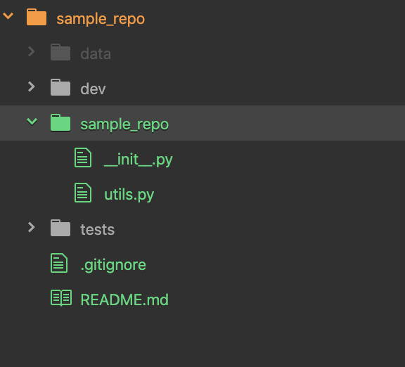

# repo_maker

## Overview
Quickly create data science project directory for python. 

```shell
>>> make_repo
What is the name of the repo? sample_repo
Do you want to create an environment? (y/n) n
No environment created.
Do you want to init git? (y/n) n
No Git Init.
```

The repository that is created is in the following format: 
<p align="center">
  
</p>

The `.gitignore` created contains standard ignore file but also includes the data directory that is created. 
The `utils.py` file contains variable `DATA_DIR` which is the absolute path to the data folder in the root directory.

## Usage
This module has a script entry with the command `make_repo`. Once called in the command line, different set up options are asked. 

These include: 
* Adding a `pipenv` environment
    * For this, `pipenv` must be install on the machine.
    * The python version of environment can also be specified. However, this python version must exist on the machine.
* Initializing `git` in the repo. 

## Getting Started
This module is pip installable. Simply clone and install with pip
``` shell
git clone https://github.com/wdeanHPA/repo_maker.git

pip install .
```

After installation, the command `make_repo` is available. 
